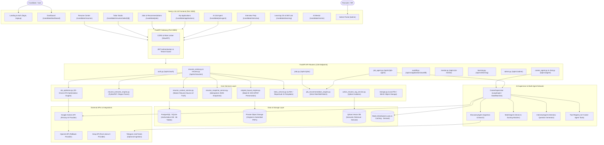

# Complete System Architecture & Working Flow

```mermaid
flowchart TD
    %% User Personas
    Candidate([Candidate / User])
    Recruiter([Recruiter / HR])

    %% Frontend Layer
    subgraph Frontend ["Next.js 16.3.8 Frontend (Port 3000)"]
        UI_Home["Landing & Auth (/login, /signup)"]
        UI_Dash["Dashboard (/candidate/dashboard)"]
        UI_Resume["Resume Center (/candidate/resumes)"]
        UI_Tailor["Tailor Studio (/candidate/resumes/tailor/[id])"]
        UI_Jobs["Jobs & Recommendations (/candidate/jobs)"]
        UI_Apps["My Applications (/candidate/applications)"]
        UI_Agent["AI Job Agent (/candidate/job-agent)"]
        UI_Interview["Interview Prep (/candidate/interview)"]
        UI_Learn["Learning OS & Skill Lab (/candidate/learning)"]
        UI_Mentor["AI Mentor (/candidate/mentor)"]
        UI_Admin["Admin Portal (/admin)"]
    end

    Candidate --> UI_Home
    Candidate --> UI_Dash
    Recruiter --> UI_Admin

    %% Backend Gateway
    subgraph BackendGateway ["FastAPI Gateway (Port 8000)"]
        CORS["CORS & Rate Limiter (SlowAPI)"]
        AuthMiddleware["JWT Authentication & Tenant Guard"]
    end

    UI_Resume --> BackendGateway
    UI_Tailor --> BackendGateway
    UI_Jobs --> BackendGateway
    UI_Apps --> BackendGateway
    UI_Agent --> BackendGateway
    UI_Interview --> BackendGateway

    %% Routers
    subgraph APIRouters ["FastAPI API Routers (126 Endpoints)"]
        R_Auth["auth.py (/api/v1/auth)"]
        R_Resume["resume_center.py & resume.py (/api/v1/resumes)"]
        R_Jobs["jobs.py (/api/v1/jobs)"]
        R_JobAgent["job_agent.py (/api/v1/job-agent)"]
        R_Autofill["autofill.py (/api/v1/applications/autofill)"]
        R_Mentor["mentor.py (/api/v1/ai-mentor)"]
        R_Learning["learning.py (/api/v1/learning)"]
        R_Admin["admin.py (/api/v1/admin)"]
        R_Chat["career_agent.py & chat.py (/api/v1/agent)"]
    end

    BackendGateway --> APIRouters

    %% Core Services Layer
    subgraph CoreServices ["Core Services Layer"]
        S_Master["resume_context_service.py (Master Resume Source of Truth)"]
        S_Extractor["resume_extractor_engine.py (PyMuPDF / Regex Parser)"]
        S_ATSOpt["ats_optimizer.py (JD-Driven ATS Optimization Engine)"]
        S_Snapshot["resume_snapshot_service.py (Idempotent JSON Snapshots)"]
        S_Layout["original_layout_engine.py (Mode B: DOCX/PDF Preservation)"]
        S_Renderer["latex_service.py (LaTeX / ReportLab 15 Templates)"]
        S_Matching["job_recommendation_engine.py (Strict Role/Skill Match)"]
        S_RAG["active_resume_rag_service.py (Qdrant Isolation)"]
        S_Storage["storage.py (Local File / MinIO Object Storage)"]
    end

    R_Resume --> S_Master
    R_Resume --> S_Extractor
    R_Resume --> S_ATSOpt
    R_Resume --> S_Snapshot
    R_Resume --> S_Layout
    R_Resume --> S_Renderer
    R_Jobs --> S_Matching
    R_JobAgent --> S_Matching

    %% AI Agent Supervisor
    subgraph AIAgent ["AI Supervisor & Multi-Agent Network"]
        Supervisor["CareerSupervisor (LangGraph / StateMachine)"]
        DiscoveryAgent["DiscoveryAgent (Ingestion & Search)"]
        MatchAgent["MatchAgent (Vector & Scoring Matcher)"]
        InterviewAgent["InterviewAgent (Interview Question Generator)"]
        ToolRegistry["Tool Registry (12 Career Agent Tools)"]
    end

    R_Chat --> Supervisor
    R_JobAgent --> Supervisor
    Supervisor --> DiscoveryAgent
    Supervisor --> MatchAgent
    Supervisor --> InterviewAgent
    Supervisor --> ToolRegistry

    %% Authoritative & Derived Data Stores
    subgraph DataStorage ["Data & Storage Layer"]
        PostgreSQL[("PostgreSQL / SQLite (Authoritative DB - 86 Tables)")]
        PrivateStorage[("Private Object Storage (Original & Submitted PDFs)")]
        QdrantStore[("Qdrant Vector DB (Semantic Retrieval - Derived)")]
        RedisStore[("Redis (Distributed Locks & Caching - Derived)")]
    end

    CoreServices --> PostgreSQL
    CoreServices --> PrivateStorage
    S_RAG --> QdrantStore
    Supervisor --> RedisStore

    %% External Integrations
    subgraph ExternalServices ["External APIs & Integrations"]
        GeminiLLM["Google Gemini API (Primary AI Provider)"]
        OpenAILLM["OpenAI API (Fallback Provider)"]
        GroqLLM["Groq API (Fast Llama-3 Provider)"]
        TelegramBot["Telegram Job Feeds (Optional Ingestion)"]
    end

    S_ATSOpt --> GeminiLLM
    Supervisor --> GeminiLLM
    GeminiLLM -.-> OpenAILLM
    DiscoveryAgent --> TelegramBot
```
