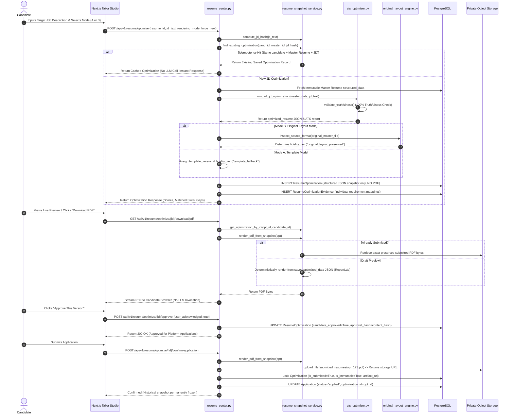

# Resume Generation & Storage Workflow

```mermaid
sequenceDiagram
    autonumber
    actor Candidate as Candidate
    participant UI as Next.js Tailor Studio
    participant Router as resume_center.py
    participant SnapshotSvc as resume_snapshot_service.py
    participant ATSOpt as ats_optimizer.py
    participant LayoutEng as original_layout_engine.py
    participant DB as PostgreSQL
    participant Storage as Private Object Storage

    %% 1. Target Job Input & Optimization
    Candidate->>UI: Inputs Target Job Description & Selects Mode (A or B)
    UI->>Router: POST /api/v1/resume/optimize {resume_id, jd_text, rendering_mode, force_new}
    Router->>SnapshotSvc: compute_jd_hash(jd_text)
    Router->>SnapshotSvc: find_existing_optimization(cand_id, master_id, jd_hash)

    alt Idempotency Hit (Same candidate + Master Resume + JD)
        SnapshotSvc-->>Router: Return Existing Saved Optimization Record
        Router-->>UI: Return Cached Optimization (No LLM Call, Instant Response)
    else New JD Optimization
        Router->>DB: Fetch Immutable Master Resume structured_data
        Router->>ATSOpt: run_full_jd_optimization(master_data, jd_text)
        ATSOpt->>ATSOpt: validate_truthfulness() (100% Truthfulness Check)
        ATSOpt-->>Router: Return optimized_resume JSON & ATS report
        
        alt Mode B: Original Layout Mode
            Router->>LayoutEng: inspect_source_format(original_master_file)
            LayoutEng-->>Router: Determine fidelity_tier ("original_layout_preserved")
        else Mode A: Template Mode
            Router->>Router: Assign template_version & fidelity_tier ("template_fallback")
        end

        Router->>DB: INSERT ResumeOptimization (structured JSON snapshot only, NO PDF)
        Router->>DB: INSERT ResumeOptimizationEvidence (individual requirement mappings)
        Router-->>UI: Return Optimization Response (Scores, Matched Skills, Gaps)
    end

    %% 2. Live Preview & Deterministic Rendering
    Candidate->>UI: Views Live Preview / Clicks "Download PDF"
    UI->>Router: GET /api/v1/resume/optimize/{id}/download/pdf
    Router->>SnapshotSvc: get_optimization_by_id(opt_id, candidate_id)
    Router->>SnapshotSvc: render_pdf_from_snapshot(opt)
    
    alt Already Submitted?
        SnapshotSvc->>Storage: Retrieve exact preserved submitted PDF bytes
    else Draft Preview
        SnapshotSvc->>SnapshotSvc: Deterministically render from saved optimized_data JSON (ReportLab)
    end
    SnapshotSvc-->>Router: Return PDF Bytes
    Router-->>UI: Stream PDF to Candidate Browser (No LLM Invocation)

    %% 3. Candidate Approval Gate
    Candidate->>UI: Clicks "Approve This Version"
    UI->>Router: POST /api/v1/resume/optimize/{id}/approve {user_acknowledged: true}
    Router->>DB: UPDATE ResumeOptimization (candidate_approved=True, approval_hash=content_hash)
    Router-->>UI: Return 200 OK (Approved for Platform Applications)

    %% 4. Application Linking & Submission Locking
    Candidate->>UI: Submits Application
    UI->>Router: POST /api/v1/resume/optimize/{id}/confirm-application
    Router->>SnapshotSvc: render_pdf_from_snapshot(opt)
    Router->>Storage: upload_file(submitted_resumes/opt_123.pdf) -> Returns storage URL
    Router->>DB: Lock Optimization (is_submitted=True, is_immutable=True, artifact_url)
    Router->>DB: UPDATE Application (status="applied", optimization_id=opt_id)
    Router-->>UI: Confirmed (Historical snapshot permanently frozen)
```
